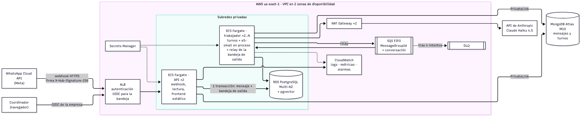
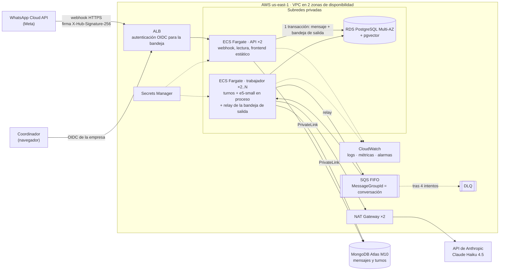

# Decisiones de diseño

> **Estado:** las secciones 1 a 9 son un **borrador para revisión del director**. El
> registro del final (D-01 a D-27) se escribió en el momento de cada decisión.
> Las cifras de costo tienen fecha y fuente; ninguna está escrita de memoria.

Criterio rector: **el código responde por la corrección; el modelo solo propone.**
El modelo elige qué herramienta usar y redacta. El código valida cada argumento,
decide el estado de la conversación, garantiza que no haya citas ni mensajes
duplicados y verifica que la respuesta no traiga datos que no estén en las fuentes.

## 1. Arquitectura general

```
backend/src/
  dominio/          reglas puras: fechas en hora de Colombia, agenda, estados, respaldo de datos
  aplicacion/       ciclo del turno (orquestador), herramientas, prompt, puertos (interfaces)
  infraestructura/  PostgreSQL, MongoDB, pg-boss, Anthropic, embeddings e5
  http/             webhook y lectura (Fastify)
  api.ts / trabajador.ts   puntos de entrada: leen el entorno y arman el sistema
```

- **Dos procesos.** La **API** recibe el webhook y sirve la lectura; nunca llama
  al LLM. El **trabajador** consume la cola y ejecuta los turnos. Así el webhook
  responde en milisegundos aunque el LLM tarde segundos, y cada proceso escala
  por separado.
- **Dónde vive cada cosa.** La lógica de negocio está en `dominio/`: funciones
  puras sin E/S y con tests exhaustivos (qué es "mañana", cuándo un horario está
  ocupado, qué estado final tiene un turno). La integración con el LLM es un
  adaptador (`infraestructura/llm/anthropic.ts`) detrás del puerto `LlmClient`.
  El orquestador no conoce el SDK.
- **LLM intercambiable.** El mismo puerto tiene una implementación falsa con
  guion (`LlmGuionado`), que usan todos los tests y el goldset. Cambiar Gemini
  por Claude (D-20) tocó un archivo de infraestructura y cero de dominio.
- **Asincronía:** cola `pg-boss` sobre el mismo PostgreSQL. El mensaje se
  registra y se encola en **una sola transacción**: si una de las dos cosas
  falla, no queda ninguna (D-01, D-17).
- **Sin LangChain ni LangGraph.** El ciclo de herramientas son unas 150 líneas
  propias. Hacía falta controlar cada paso: tope de iteraciones, tiempo límite
  con un reintento, errores que vuelven al modelo, la barandilla de datos y la
  traza completa del turno.

## 2. Modelo de datos

**PostgreSQL guarda lo que necesita transacciones y restricciones:**

| Tabla | Para qué | Restricción o índice clave |
|---|---|---|
| `sedes`, `especialidades`, `profesionales`, `horarios` | agenda | `UNIQUE (profesional_id, inicio)`; índice `(sede_id, inicio)` para disponibilidad |
| `citas` | citas | **índice único parcial `(horario_id) WHERE estado = 'activa'`** |
| `conversaciones` | una por teléfono, con su estado | `UNIQUE (telefono)`; índices `(estado, ultimo_mensaje_en DESC, id DESC)` y `(ultimo_mensaje_en DESC, id DESC)` para la bandeja |
| `mensajes_entrantes` | idempotencia y fuente del trabajador | `PRIMARY KEY (message_id)`; índice `(conversacion_id, enviado_en)` |
| `documentos`, `fragmentos` | RAG | `vector(384)`, distancia coseno |

**MongoDB guarda lo que crece rápido y cambia de forma:**

| Colección | Contenido | Índice |
|---|---|---|
| `mensajes` | texto de entrada y salida, `_id` determinista (`<message_id>:entrada` o `:salida`) | `(conversacion_id, fecha, orden)` |
| `turnos` | traza: modelo, tokens, costo, latencia, llamadas al LLM, herramientas con argumentos y resultados, controles, estado final | `(conversacion_id, fecha)` |

El criterio fue el tipo de dato. Una cita mal duplicada es un error de negocio, así
que va donde hay restricciones. Una traza de turno tiene forma variable (cada
herramienta devuelve otra cosa) y crece con cada mensaje, así que va a documentos.
Además, el historial por teléfono se resuelve sin JOIN: `conversaciones.telefono`
lleva a `conversacion_id` y de ahí al índice de `mensajes`.

**No hay citas duplicadas.** La garantía es el índice único parcial. `agendar_cita`
lee y decide con la regla del dominio, pero si otro paciente inserta entre la
lectura y la inserción, el `INSERT` recibe `23505` y se responde `horario_ocupado`.
Lo cubren un test determinista (otra transacción bloquea la inserción) y 25 rondas
concurrentes, más 20 grupos en disputa en el harness de volumen (D-19).

**No hay mensajes procesados dos veces.** `message_id` es la llave primaria. Un
duplicado choca en el `INSERT`, la transacción se revierte y la respuesta es 200 sin
encolar. Diez envíos simultáneos del mismo id dan un solo 202 (test). Si un turno se
reintenta, los `upsert` sobre `_id` determinista sobrescriben en MongoDB y
`agendar_cita` devuelve la misma cita (D-13, D-22).

**Consistencia entre las dos bases** (D-01, D-14, D-15):
1. PostgreSQL confirma primero: cita y estado de la conversación.
2. MongoDB se escribe con `upsert` sobre `_id` determinista.
3. El mensaje pasa a `procesado` solo después de que MongoDB confirmó.

Si MongoDB falla, el trabajo se reintenta. Si se agotan los reintentos, el mensaje
queda `fallido` y la conversación escalada, sin bloquear las siguientes. Medido:
con MongoDB en pausa 60 s se reintentaron 38 trabajos y no se perdió ningún
mensaje (D-23).

## 3. Nube (AWS)

Diseño para 50 clínicas y 20.000 mensajes al día (~0,23 por segundo en promedio y
2 a 3 en hora pico).



Fuente del diagrama (Mermaid; la imagen se genera con
`npx @mermaid-js/mermaid-cli -i docs/aws-arquitectura.mmd -o docs/aws-arquitectura.png -b white -s 2`):



**Servicios y por qué:**
- **Cómputo:** ECS Fargate (ARM). Hay dos servicios de larga vida (API y
  trabajador), sin servidores que administrar. El trabajador carga el modelo de
  embeddings (118 MB) una vez al arrancar.
  - *Descarté Lambda* para el trabajador: un turno puede durar hasta 200 s y
    cada arranque en frío recargaría el modelo.
  - *Descarté EKS:* un clúster de Kubernetes para dos servicios es costo
    operativo sin beneficio.
- **Cola:** SQS FIFO con `MessageGroupId` = conversación, que da la misma
  semántica que `key_strict_fifo` (un turno a la vez por conversación, en orden
  de llegada), más `MessageDeduplicationId` = `message_id` y una cola de
  mensajes fallidos.
  - **Por qué SQS y no pg-boss en producción:** la cola sobrevive a una
    conmutación o mantenimiento de RDS, la redirección desde la cola de fallidos
    viene incluida, la profundidad de la cola es una métrica nativa para escalar
    el trabajador, y se quita el sondeo constante sobre la base.
  - **Costo de SQS:** se pierde el encolado en la misma transacción. Se
    compensa con una **bandeja de salida**: `mensajes_entrantes` ya es esa
    bandeja, y un relay publica los mensajes en `recibido`. A 20.000 mensajes
    diarios pg-boss alcanzaría de sobra; elijo SQS por operabilidad, no por
    capacidad.
- **Bases de datos:**
  - RDS PostgreSQL Multi-AZ, que tiene pgvector disponible.
  - MongoDB Atlas M10 en la misma región, con PrivateLink.
  - *Descarté DocumentDB:* evita un proveedor más, pero su compatibilidad con
    MongoDB es parcial.
  - *Descarté OpenSearch para vectores:* con unos 1.000 fragmentos (50 clínicas
    × ~20), pgvector con recorrido exacto sobra.
- **Secretos:** Secrets Manager para la key de Anthropic y las credenciales,
  inyectados como variables de entorno de la tarea.
- **Red:** subredes privadas en dos zonas. La única salida a internet es la API
  de Anthropic, por NAT. *Descarté endpoints de interfaz para SQS, Secrets
  Manager, ECR y Logs:* costarían unos USD 73 al mes por 5 endpoints en 2 zonas
  (USD 0,01 por hora cada uno), para un tráfico que por NAT cuesta centavos. El
  bucket de S3 usa el endpoint de gateway, que es gratuito.
- **Observabilidad:**
  - logs JSON con el teléfono enmascarado en CloudWatch Logs;
  - métricas propias: turnos por estado final, tasa de fallas del LLM,
    activaciones de la barandilla, costo por turno, antigüedad del mensaje más
    viejo en SQS, profundidad de la cola de fallidos;
  - alarmas sobre la cola de fallidos > 0, la antigüedad de la cola > 60 s y la
    tasa de `falla_llm` > 5 %.

**Cómo escala:**
- **Trabajador:** escala por `ApproximateAgeOfOldestMessage` de SQS.
- **API:** escala por CPU o por peticiones al ALB.
- **Capacidad medida** con el harness de volumen: un trabajador con 20 turnos en
  paralelo procesa entre 10 y 16 turnos por segundo con 1 s de latencia simulada
  del LLM (D-24). Con Haiku real (1,4 a 4,4 s por turno), un solo trabajador
  cubre la hora pico; el segundo es por disponibilidad.
- **El techo real son los límites de tasa de Anthropic** del nivel contratado,
  no AWS.

**Qué pasa si se cae una pieza:**

| Falla | Comportamiento |
|---|---|
| Una tarea de la API | El ALB enruta a la otra. Meta reintenta los webhooks no 2xx, y la idempotencia absorbe los reintentos |
| Una tarea del trabajador | El mensaje vuelve a SQS al vencer su tiempo de visibilidad. El orden por conversación se mantiene |
| Conmutación de RDS (~1–2 min) | El webhook responde 5xx y Meta reintenta. El trabajador reintenta con espera exponencial |
| Primario de Atlas | Escrituras reintentables del driver más los reintentos de la cola. Medido: 60 s sin MongoDB, sin pérdida |
| API de Anthropic caída | Mensaje fijo, conversación escalada, turno con el error (D-14). Una alarma avisa por la tasa de `falla_llm` |
| Una zona completa | Todo es multizona: dos NAT, RDS Multi-AZ, tareas repartidas |

**Costo mensual estimado de infraestructura** (us-east-1, 730 h). Precios
consultados el 2026-10-03 en la Price List API de AWS (publicada el 2026-10-01),
en las páginas de Fargate y CloudWatch y en la de MongoDB Atlas:

| Componente | USD/mes |
|---|---:|
| Fargate API: 2 × (0,5 vCPU, 1 GB) ARM a $0,0000089944/vCPU-s y $0,0000009889/GB-s | 28,8 |
| Fargate trabajador: 2 × (1 vCPU, 2 GB) | 57,7 |
| RDS PostgreSQL db.m7g.large Multi-AZ ($0,337/h) + 50 GB gp3 Multi-AZ ($0,23/GB-mes) | 257,5 |
| MongoDB Atlas M10 ($0,08/h) | 58,4 |
| ALB ($0,0225/h + ~1 LCU a $0,008/h) | 22,3 |
| NAT Gateway × 2 ($0,045/h) + 30 GB ($0,045/GB) | 67,0 |
| PrivateLink a Atlas: 2 zonas ($0,01/h) | 14,7 |
| SQS FIFO: ~2 M peticiones ($0,50 por millón) | 1,0 |
| Secrets Manager: 3 secretos ($0,40) | 1,2 |
| CloudWatch: 3 GB de logs ($0,50/GB), 5 métricas ($0,30) y 2 alarmas ($0,10) sobre el nivel gratuito | 3,3 |
| ECR: 1 GB ($0,10/GB-mes) | 0,1 |
| **Total** | **≈ 512** |

Supuestos: unos 50 KB de tráfico por turno hacia Anthropic, 3 KB de logs por
mensaje y 30 días de retención. No incluye impuestos, transferencia entre zonas
ni backups por encima del tamaño de la base, que a este volumen son marginales.
Ahorros posibles, cada uno con su costo:
- un solo NAT: −USD 33, a costa de perder la salida a internet si cae esa zona;
- `db.t4g.large` Multi-AZ: −USD 58, con instancia de rendimiento variable;
- Savings Plans para Fargate y RDS.

**Separación de datos por clínica:**
- **Tenant:** `clinica_id` en todas las tablas de PostgreSQL y en todos los
  documentos de MongoDB. Las llaves únicas lo incluyen; por ejemplo,
  `(clinica_id, telefono)`, porque un paciente puede escribirles a dos clínicas.
- **Row-Level Security en PostgreSQL:** políticas
  `USING (clinica_id = current_setting('app.clinica_id')::int)`. La aplicación
  hace `SET LOCAL app.clinica_id` en cada transacción y se conecta con un rol
  sin `BYPASSRLS`. Así un error en una consulta no filtra datos de otra clínica.
- **MongoDB:** los índices empiezan por `clinica_id` y la capa de acceso exige el
  tenant en cada consulta (Atlas no tiene RLS).
- **Resolución del tenant:** por el `phone_number_id` de WhatsApp de cada
  clínica, que llega en el webhook.
- **Por clínica:** documentos y fragmentos (la búsqueda vectorial filtra por
  `clinica_id` antes de ordenar por distancia), zona horaria, sedes y
  configuración del prompt. Cada turno guarda su costo, así que la facturación
  por clínica sale de `turnos`.
- *Descarté una base por clínica* (50 bases que migrar y monitorear) y *un
  esquema por clínica* (50 migraciones por cambio). Quedan reservados para una
  clínica que exija aislamiento físico por contrato.

## 4. Pipeline de IA

- **Partición:** una sección `##` es un fragmento, con el título del documento y
  la sección dentro del texto que se embebe. Los documentos son cortos y cada
  sección trata un tema; partir más fino separaba datos de su contexto.
- **Embeddings:** `multilingual-e5-small`, local y en proceso (ONNX q8, 118 MB,
  384 dimensiones), con los prefijos `query: ` y `passage: ` que exige su ficha.
  *Descarté `bge-m3`* (2,27 GB, 1.024 dimensiones, 8.192 tokens): su capacidad
  no aporta con fragmentos de menos de 100 palabras (D-25).
- **Base vectorial:** pgvector en el mismo PostgreSQL, con recorrido exacto
  (sin HNSW, D-07) y k = 4.
- **Calidad medida con un goldset** (`npm run harness:rag`, 40 preguntas):
  Recall@1 0,958, Recall@4 1,000, MRR@4 0,972, AUC-ROC 0,885. Umbral 0,837
  (D-25).
- **Prompt:** se arma en cada turno con:
  - fecha, hora, día y "mañana" en hora de Colombia, calculados desde el
    `timestamp` del mensaje y no desde el reloj del servidor;
  - las sedes y especialidades leídas de la base;
  - reglas: responder solo con lo que devuelvan las herramientas y no afirmar
    ni negar lo que no aparece;
  - formato de WhatsApp.

  El teléfono nunca llega al LLM; el goldset y el harness de volumen lo
  verifican en cada pedido.
- **Ciclo de tool calling:**
  - **Tope** de 5 llamadas al LLM por turno; al agotarse, mensaje fijo y
    escalamiento.
  - **Validación:** cada herramienta valida con un esquema zod estricto, que
    también genera la definición que ve el modelo. Un error vuelve al modelo
    como `tool_result` con `is_error`, el código del error y un detalle que dice
    cómo corregir (por ejemplo, la lista de sedes válidas).
  - **Casos cubiertos:** argumentos que no son JSON, herramientas que no
    existen y campos de más, cada uno con su caso en el goldset.
  - **El estado final lo decide el código** según lo que pasó, no según lo que
    dice el modelo (D-05, D-12).

## 5. Confiabilidad

**Que no invente datos.** Son tres capas, porque ninguna alcanza sola (D-26):
1. el umbral de similitud, que filtra lo que está fuera de dominio;
2. el prompt (si no está en los fragmentos, ni lo afirma ni lo niega);
3. una verificación determinista en código: todo número de la respuesta
   (hora, precio, teléfono, dirección, fecha) tiene que estar en la evidencia
   del turno. Si no está, el modelo corrige una vez; si insiste, se descarta su
   respuesta y la conversación escala.

**Medido** con Haiku real y un juez Sonnet que ve el corpus completo: exactitud
del 92 % en preguntas con respuesta, abstención correcta del 94 % en preguntas sin
respuesta e invención global del 3 % (1 de 40: una negación sin cifras, que la
capa 3 no puede ver).

**Que no afirme acciones que no hizo** (D-29): una cita que la respuesta afirma
tiene que haberse agendado en el turno (detección por reglas, más un verificador
con Haiku para las paráfrasis), y una promesa de pasar con un humano se cumple
escalando. En 10 conversaciones reales, Haiku afirmó la cita sin agendarla en la
mitad de los turnos de confirmación; la barandilla corrigió 4 y escaló 1, y
**ninguna confirmación falsa llegó al paciente.**

**Si el LLM falla o tarda:** 20 s de límite por llamada con un reintento propio.
Si falla de nuevo, el paciente recibe un mensaje fijo y la conversación queda
`escalada`, con el error en la traza. Una conversación escalada no vuelve a llamar
al LLM. Si se agotan los reintentos de infraestructura (por ejemplo, MongoDB
caído), el mensaje queda `fallido` sin bloquear la conversación (D-14).

**Cómo se verificó:**
- **211 tests** contra PostgreSQL y MongoDB reales, sin LLM real.
- **Goldset de 32 conversaciones:** cubre cada código de error, las fallas del
  LLM, duplicados, concurrencia, zona horaria y las barandillas. 31 se corren
  con el LLM falso y 10 también con Haiku real.
- **Harness de volumen:** 2.100 mensajes con duplicados, disputas por horario y
  caos del LLM y de MongoDB, verificando 7 invariantes.

Los bugs más serios no los encontraron los tests: el historial en reintentos
(D-22) y el umbral en 0 por una variable vacía (D-25) los encontraron los
harness; el desorden con timestamps iguales (D-28) y las acciones afirmadas sin
hacerse (D-29), seguir el README desde un clon limpio con el modelo real.

## 6. Costo

**Costo por turno, medido con Haiku 4.5** a $1 de entrada y $5 de salida por
millón de tokens (página oficial, 2026-10-03):

| Medición | Tokens por turno | USD por turno |
|---|---|---:|
| 40 preguntas informativas (e2e del RAG) | ~1.600–4.500 de entrada | 0,0043 de promedio |
| Conversación del enunciado, 3 turnos | 1.650–6.960 de entrada | 0,0053 de promedio |
| Prueba de humo con disponibilidad | 4.451 + 304 | 0,0060 |

- **Una conversación típica** (pregunta, elección y confirmación) cuesta unos
  **USD 0,016**. Una conversación escalada no cuesta nada por cada mensaje
  posterior, porque no llama al LLM.
- **A escala:** 20.000 turnos diarios × USD 0,005 × 30 días ≈ **USD 3.000 al
  mes de LLM** (entre 2.400 y 3.600), frente a unos **USD 512 de
  infraestructura**. El LLM es cerca del **85 %** del total, unos USD 70 por
  clínica al mes.

**Cómo lo reduciría, en orden de impacto:**
1. **Achicar lo que se le manda al modelo.** `consultar_disponibilidad` devuelve
   el día completo con el nombre del profesional en cada bloque. Agrupar por
   profesional reduce los tokens de entrada de los turnos de agenda.
2. **Guardar los `horario_id` ofrecidos en el historial.** Evita la segunda
   consulta del flujo de agendamiento (D-16): una llamada menos por cita.
3. **Historial de 10 mensajes en lugar de 20,** midiendo con el goldset real que
   no se pierda contexto.
4. **Prompt caching.** No aplica hoy porque Haiku 4.5 exige prefijos de 4.096
   tokens y el nuestro mide ~1.500 (D-21). Con instrucciones por clínica o con
   un modelo de mínimo 512 tokens, la lectura en caché costaría el 10 % del
   precio base.
5. **Infraestructura:** un NAT, `db.t4g.large` y Savings Plans ahorran ~USD 100
   al mes, poco al lado del LLM.

## 7. Trade-offs

| Decisión | Lo que se ganó | Lo que se pagó |
|---|---|---|
| `key_strict_fifo` para la serie por conversación (D-03) | Orden y exclusión garantizados por la base, sin conexiones retenidas | Orden de llegada, no de `timestamp`; un trabajo fallido bloquea la conversación (de ahí D-14) |
| El historial que ve el modelo es solo texto (D-16) | Menos tokens por turno | Una consulta de disponibilidad extra al agendar |
| El umbral del RAG está calibrado sobre el mismo goldset (D-25) | Un valor medido y no intuido | Sin datos apartados; margen de 0,001 |
| Barandilla numérica determinista (D-26) | Sin costo ni latencia, explicable y testeable | No ve afirmaciones sin cifras |
| Cita afirmada: reglas más verificador LLM solo cuando un filtro dispara (D-29) | Cubre paráfrasis sin pagar una llamada en cada turno | Una paráfrasis que no pase el filtro amplio (sin "cita" ni raíz de reservar) no se verifica |
| Estado de la conversación que solo sube (D-05) | La bandeja no esconde citas por un "gracias" | Una conversación con cita antigua sigue como `cita_agendada` |
| Sin coincidencia difusa en sedes y especialidades (D-11) | Nunca agenda en el lugar equivocado | El modelo a veces tiene que preguntar |
| Embeddings locales en la prueba | Sin costo ni red, y tests rápidos | El trabajador carga 118 MB al arrancar |
| Teléfono enmascarado en la API (D-27) | Sin datos sensibles expuestos sin autenticación | El coordinador no puede llamar desde la interfaz |
| SQS en producción en lugar de pg-boss | Operabilidad y escalado por profundidad de la cola | Una bandeja de salida y un relay más que mantener |

## 8. Uso de IA

Usé Claude Code para escribir el código, los tests y los harness. El diseño, las
decisiones y la revisión de cada paso fueron míos. `NOTAS_IA.md` registra, en el
momento en que pasaron, los errores de la IA que se corrigieron. Los más
instructivos:

- **Errores de especificación:** el plan inicial tenía un índice sobre un campo
  que no existía, un trabajador sin acceso al texto del mensaje y ningún lugar
  para el costo.
- **Errores de arquitectura:** `aplicacion/` importaba infraestructura,
  contra la regla del propio plan.
- **Errores que solo vieron los harness:** el historial en reintentos (D-22),
  el umbral efectivo en 0 por una variable vacía, y un caso de goldset que
  esperaba un único camino del modelo real.
- **Mediciones que casi engañan:** una instrumentación con `sed` que no se
  aplicó y "probaba" que el índice único nunca actuaba; una prueba de caos de
  8 s que no provocó ni un reintento; un juez LLM que se contradijo.
- **Lo que validé a mano:** cada cifra de costo (páginas oficiales y Price
  List API), las fichas de los modelos de embeddings, la API instalada de
  pg-boss antes de diseñar la cola y los veredictos del juez leyendo los casos.

La lección general: un número vale si se verifica cómo se obtuvo. Por eso las
corridas guardan su configuración, los harness cuentan los reintentos y el juez
tiene una regla de consistencia.

## 9. Qué haría distinto con más tiempo o en producción

- **Evaluación:**
  - un goldset más grande y revisado por la clínica (hoy todos los casos tienen
    `validado_por: null`);
  - un conjunto apartado para el umbral del RAG;
  - correr el goldset real en cada cambio de prompt o de modelo, con el costo
    reportado;
  - un verificador LLM como cuarta capa contra afirmaciones sin cifras (D-26),
    si la tasa de invención real lo justifica;
  - memoria de herramientas en el historial (los `horario_id` ofrecidos), para
    que el modelo agende en lugar de afirmar (D-29) y se ahorre la segunda
    consulta (D-16).
- **Observabilidad:** OpenTelemetry con un span por turno, por llamada al LLM y
  por herramienta, y un panel de costo por clínica y de tasas de escalamiento,
  barandilla y falla.
- **Varias clínicas:** el `clinica_id` con RLS de la sección 3, límites de tasa
  por clínica y su configuración propia (prompt, zona horaria, documentos).
- **Producto:** cancelar y reprogramar citas (hoy las cancela un asesor),
  autenticación del coordinador con el teléfono completo para los autorizados, y
  verificación de la firma del webhook de Meta.
- **Tratamiento de datos:** los mensajes de los pacientes van a un proveedor
  externo de LLM. El teléfono nunca se envía, pero el nombre sí (es necesario
  para agendar), y el texto libre puede traer síntomas. En producción haría
  falta:
  - consentimiento informado al primer mensaje (en Colombia, la Ley 1581 de
    2012 trata los datos de salud como sensibles);
  - un acuerdo de tratamiento de datos con el proveedor, o usar Claude por
    Amazon Bedrock para que el tráfico no salga de la cuenta de AWS;
  - retención limitada de `mensajes` y `turnos`, con TTL o archivo en S3.

---

## Apéndice · Registro de decisiones y ambigüedades del enunciado

Escrito en el momento de cada decisión, en orden. Las revisadas conservan su versión descartada y el porqué.

### D-01 · El texto del mensaje entrante vive en PostgreSQL
`mensajes_entrantes` guarda `texto` y `enviado_en` (el `timestamp` del webhook),
además del `message_id`. El trabajador lee de ahí, no del contenido del trabajo en
la cola: si el trabajo se reintenta o la cola cambia (pg-boss → SQS), el mensaje
sigue estando en la fuente de verdad.

### D-02 · El costo de cada turno se calcula y se guarda
El enunciado pide que el coordinador vea "cuánto costó". Cada turno guarda
`costo_usd`, calculado con los tokens que reporta el proveedor y los precios por
millón de tokens de `LLM_PRECIO_ENTRADA_1M` y `LLM_PRECIO_SALIDA_1M`. Los precios
van en configuración y no en el código porque cambian; el valor usado se anota
con fecha de consulta.

### D-03 · Mensajes del mismo teléfono: uno a la vez y en orden (revisada)
**Versión final:** la cola de `pg-boss` usa la política `key_strict_fifo` con
`singletonKey` = id de la conversación. La base garantiza, entre todos los
trabajadores, un solo trabajo activo por conversación y orden FIFO por clave.
Conversaciones distintas se procesan en paralelo.

**Primera versión, descartada:** un bloqueo consultivo por conversación
(`pg_try_advisory_lock`), con reencolado si estaba tomado y procesamiento de
los pendientes por `enviado_en`. Se descartó al revisar la API de pg-boss 12:
retenía una conexión durante la llamada al LLM, reencolaba en bucle cuando había
contención y había que reimplementarlo en producción. `key_strict_fifo` es el
mismo modelo que una cola SQS FIFO con `MessageGroupId` = conversación, así que
el diseño de AWS no cambia la semántica.

**Costos aceptados:**
- El orden es el de llegada al webhook, no el del `timestamp`. Si WhatsApp
  entrega dos mensajes invertidos, se procesan invertidos.
- Un trabajo que termina `failed` bloquea la conversación. Por eso el trabajador
  nunca deja fallar el último intento (D-14).
- Depende de una función reciente de pg-boss (12.x).

### D-04 · La agenda del seed y la fecha del ejemplo
El seed genera 14 días calendario desde hoy (hora de Colombia). `SEED_DESDE`
(YYYY-MM-DD) permite fijar el primer día, para reproducir el ejemplo del enunciado
(`2026-10-06T03:40:00Z`) aunque se evalúe en otra fecha. El simulador envía la hora
actual como `timestamp`. "Fecha pasada" y "horario pasado" se validan contra el
`timestamp` del mensaje, no contra el reloj del servidor.

### D-05 · Transiciones de estado de la conversación (revisada)
- El estado de la conversación solo sube de prioridad:
  `escalada` > `cita_agendada` > `resuelta_por_ia` > `abierta`. El estado final
  de cada turno se guarda aparte, en su traza en MongoDB.
- **Por qué:** la bandeja es la herramienta del coordinador y debe mostrar lo
  más importante que pasó en la conversación, no lo último. Con la primera
  versión ("el estado del último turno"), un "gracias" después de agendar bajaba
  la conversación a `resuelta_por_ia` y la escondía del filtro `cita_agendada`.
  Como cancelar no está en el alcance, nada legítimo deshace una cita.
- **Costo:** un paciente con una cita anterior que vuelve con otra consulta sigue
  apareciendo como `cita_agendada`. Lo compensan la bandeja ordenada por último
  mensaje y el detalle con el estado de cada turno.
- `escalada` es terminal: los mensajes siguientes reciben un mensaje fijo y no
  pasan por el LLM. Reabrir una conversación escalada es trabajo del humano y
  queda fuera del alcance.

### D-06 · Seed idempotente por llaves naturales
`sedes.nombre`, `especialidades.nombre`, `profesionales.nombre` y
`horarios (profesional_id, inicio)` son únicos; el seed inserta con
`ON CONFLICT DO NOTHING`. Correrlo dos veces no duplica; correrlo otro día agrega
solo los días que faltan.

### D-07 · Sin índice vectorial aproximado
Con un corpus de decenas de fragmentos, el recorrido completo con distancia coseno
es exacto y barato. HNSW o IVFFlat se justificarían con miles de fragmentos por
clínica.

### D-08 · Validación del cuerpo del webhook
- `timestamp` debe ser ISO 8601 **con zona** (`Z` u offset). Uno sin zona es
  ambiguo (¿hora de Colombia o UTC?) y la invariante de la hora depende de él: se
  rechaza con 400.
- `text`: no vacío después de recortar espacios, máximo 4.096 caracteres (el
  límite de un mensaje de texto de WhatsApp).
- `from`: formato E.164 (`+` y de 8 a 15 dígitos).
- Campos de más → 400. El webhook acepta exactamente lo que el enunciado define.

### D-09 · Dos harness además de los tests
Los tests de Vitest prueban piezas; no dicen si el sistema armado maneja cada
excepción ni si las invariantes aguantan con carga. Se agregan:
- un **goldset** de conversaciones guionadas que cubre cada situación con nombre
  (cada código de error, fallas del LLM, duplicados, concurrencia, zona horaria),
  ejecutable sin LLM (modo guion) y con el LLM real;
- un **harness de volumen** que dispara mensajes concurrentes con duplicados y
  contención por horario, y verifica las invariantes al final.
El patrón viene del harness de evaluación de otro proyecto propio (guion
declarado, transcript antes de puntuar, configuración junto a la medición). El
costo: más código que mantener y casos escritos por quien construyó el sistema
(`validado_por: null`), que prueban que el sistema hace lo que se decidió, no que
lo decidido sea lo correcto.

### D-10 · La agenda del seed tiene huecos a propósito
Dermatología no atiende en la Sede Norte los martes y jueves, y la Sede Sur solo
tiene dermatología en la tarde esos días. Así el ejemplo del enunciado ("mañana en
la tarde", martes 6) tiene respuesta en una sede y `sin_horarios` en la otra.

### D-11 · Cómo se reconoce una sede o especialidad que nombra el modelo
Se compara sin mayúsculas, tildes ni espacios de más, y se acepta la sede sin la
palabra "sede" ("norte" → Sede Norte). No hay coincidencia aproximada: "derma" no
es Dermatología. Una coincidencia difusa podría agendar en el lugar equivocado;
es preferible devolver `especialidad_inexistente` con la lista válida y que el
modelo pregunte.

### D-12 · Agendar y escalar en el mismo turno
Si en un turno se agendó una cita y además se escaló, el estado final es
`escalada`: la cita queda hecha, pero hay algo que un humano tiene que mirar.

### D-13 · Un horario "pasado" es uno que ya empezó
Se compara el inicio del bloque contra el `timestamp` del mensaje. El reintento
de un turno que ya agendó se revisa **antes** que la hora: si la cita es de esta
conversación, se devuelve aunque el reintento llegue cuando el bloque ya empezó.

### D-14 · El último intento no se deja fallar
Cada mensaje tiene 1 intento más 3 reintentos con espera exponencial. Si el
último también falla (por ejemplo, MongoDB caído todo ese tiempo), el
trabajador:
- marca el mensaje `fallido`;
- pasa la conversación a `escalada`;
- intenta guardar el mensaje fijo;
- y termina el trabajo sin error, para no bloquear la conversación (D-03).

Si MongoDB sigue caído, el mensaje fijo no queda guardado. El coordinador ve la
conversación escalada en la bandeja, que se lee de PostgreSQL.

### D-15 · Orden de los mensajes en MongoDB
Entrada y salida llevan la misma `fecha` (el `timestamp` del mensaje del
paciente) y un campo `orden` (0 y 1). El historial se ordena por
`(fecha, orden)`. Si la salida usara la hora del servidor, un mensaje con
`timestamp` futuro (como los del enunciado) quedaría después de su respuesta.

### D-16 · El historial que ve el modelo es solo texto
Al LLM le llegan los últimos 20 mensajes de paciente y asistente, sin las
llamadas a herramientas de turnos anteriores. Es más barato y basta para el
contexto de la conversación. A cambio, el modelo no ve los `horario_id` de un
turno anterior: si el paciente elige un horario ofrecido antes, tiene que volver
a consultar disponibilidad. Así además confirma que el horario sigue libre.

### D-17 · Respuestas del webhook
- **202** `{estado: "recibido"}`: mensaje nuevo, registrado y encolado.
- **200** `{estado: "duplicado"}`: el `message_id` ya existía. La transacción se
  revierte, así que un duplicado no toca la conversación.
- **400** `{error: "cuerpo_invalido", detalle: [{campo, mensaje}]}`: cuerpo
  inválido, incluidos JSON mal formado y texto plano.
- **500**: si falla el encolado, la transacción se revierte y no queda nada. El
  proveedor reintenta y el mensaje entra como nuevo.

### D-18 · Las herramientas: validación y forma de los errores
- **Una sola fuente.** El esquema zod que valida los argumentos genera también
  el JSON Schema que ve el modelo (`z.toJSONSchema`). No pueden desalinearse.
- **Orden de validación** en `consultar_disponibilidad`:
  1. esquema (campos, tipos, campos de más);
  2. formato de la fecha;
  3. especialidad;
  4. sede;
  5. fecha pasada;
  6. horarios libres.

  Ante varios errores, el modelo recibe primero el que exige preguntarle algo al
  paciente.
- **El error dice cómo corregir.** `especialidad_inexistente` y
  `sede_inexistente` traen la lista de nombres válidos; `horario_ocupado` pide
  volver a consultar.
- **`consultar_disponibilidad` devuelve el día completo.** No filtra por mañana
  o tarde: con a lo sumo ~20 bloques por especialidad y sede, el modelo elige
  la franja. Agregar un parámetro de franja sumaría otro argumento que el modelo
  puede mandar mal.
- **`escalar_a_humano` no escribe en la base.** El estado `escalada` lo fija el
  código al cerrar el turno, igual que los demás estados (estadoFinalDelTurno).

### D-19 · Cita duplicada: lectura previa más índice único
`agendar_cita` lee el horario y la cita activa, decide con la regla del dominio
e inserta, todo en una transacción. La lectura previa resuelve el caso común con
un mensaje claro. La garantía es el índice único parcial: si otro paciente
inserta entre la lectura y la inserción, el `INSERT` recibe `23505`, se vuelve
a un savepoint, se relee la cita ganadora y se devuelve `horario_ocupado` (o
éxito, si la ganadora es de la misma conversación). No se usa `SELECT … FOR
UPDATE` sobre el horario: el índice ya serializa, y un bloqueo explícito
agregaría esperas sin cambiar el resultado.

### D-20 · Proveedor de LLM: Claude Haiku 4.5
Decisión del director, que reemplaza el plan inicial (Gemini por su punto de
acceso compatible con OpenAI). Se usa `claude-haiku-4-5` con el SDK oficial
`@anthropic-ai/sdk`, sin LangChain, con el ciclo de herramientas escrito a mano.
- **Precio** (página oficial, consultada el 2026-10-03): $1 por millón de tokens
  de entrada y $5 por millón de salida. Usar herramientas agrega 496 tokens de
  prompt de sistema por llamada.
- **Reintentos:** el SDK se configura con `maxRetries: 0`. El orquestador hace
  una llamada y un reintento con su propio límite de 20 s. Si el SDK también
  reintentara, el peor caso pasaría de 40 s a 120 s.
- **Errores:** cancelación y tiempo agotado → `timeout`; cualquier otro error
  del SDK (4xx, 5xx, conexión) → `proveedor`. `stop_reason` `max_tokens` o
  `refusal` también son falla: no se usa una respuesta incompleta.
- **Medido con el goldset real** (3 turnos del ejemplo del enunciado): entre
  1.650 y 6.960 tokens de entrada por turno, USD 0,016 la conversación completa,
  de 1,4 a 4,4 s por turno.

### D-21 · Sin prompt caching (por ahora)
Haiku 4.5 solo cachea prefijos de 4.096 tokens o más. El prefijo estable
(definiciones de herramientas y prompt de sistema) mide unos 1.500 tokens, así
que `cache_control` no tendría efecto. Además, el prompt de sistema lleva la
fecha y la hora del turno; si algún día se cachea, esa parte tiene que ir
después del último punto de corte. Se reevalúa si el prefijo crece (por
ejemplo, con instrucciones por clínica) o si se cambia a un modelo con un
mínimo de 512 tokens.

### D-22 · Un reintento no ve su propia respuesta anterior
Lo encontró el harness de volumen pausando MongoDB 25 s. Si un intento guardaba
la respuesta (`:salida`) y fallaba al guardar el turno, el reintento leía el
historial con esa respuesta incluida: el modelo veía su propia contestación al
mensaje que estaba respondiendo. En los grupos que peleaban por un horario, la
cita quedaba hecha en PostgreSQL, pero el reintento no volvía a llamar a
`agendar_cita`: la traza la perdía y la conversación bajaba de `cita_agendada` a
`resuelta_por_ia`. Ahora el historial de un turno excluye la salida de su propio
mensaje. El reintento vuelve a llamar a `agendar_cita`, que devuelve "ya era
tuya" (invariante 4), y la traza queda completa. Hay un test de regresión en
`tests/trabajador.test.ts`.

### D-23 · MongoDB con `socketTimeoutMS`
Sin ese límite, una operación contra un MongoDB que dejó de responder espera
para siempre, y el trabajo nunca falla ni se reintenta. Con 10 s, la operación
falla y la cola reintenta con espera exponencial. Medido con el harness de
volumen: una pausa de 8 s no provoca reintentos (las operaciones esperan y
siguen); con 25 s se reintentan 8 trabajos y con 60 s, 38 (hasta el último
intento). En los tres casos no hubo mensajes perdidos ni violaciones.

### D-24 · Capacidad medida
Con el harness de volumen (LLM falso con 300–1.500 ms de latencia, 20 turnos en
paralelo, un solo proceso trabajador): el webhook responde con p95 de 57 ms a
más de 3.000 peticiones por segundo, y el trabajador procesa entre 10 y 16 turnos
por segundo. El escenario del enunciado (20.000 mensajes al día, ~2–3 por segundo
en hora pico) usa una fracción de un solo proceso. En esas corridas el cuello de
botella es la latencia del LLM, no las bases. La prueba fue una ráfaga de 2.100
mensajes de una vez, no un flujo sostenido. Con el LLM real la latencia por
turno es de 1,4 a 4,4 s (D-20), así que la concurrencia del trabajador debe
dimensionarse con esa cifra y con los límites de tasa del proveedor.

### D-25 · RAG: modelo, partición, umbral y cómo se midió
- **Modelo:** `multilingual-e5-small`, local, en proceso (ONNX cuantizado q8).
  Cifras de las fichas oficiales, consultadas el 2026-10-03:

  | | `multilingual-e5-small` | `bge-m3` |
  |---|---|---|
  | Parámetros | 117.654.272 | — |
  | Capas | 12 | 24 |
  | Dimensiones | 384 | 1.024 |
  | Entrada máxima | 512 tokens | 8.192 tokens |
  | Peso en disco | 118 MB (ONNX q8), 470 MB (fp32) | 2,27 GB |

  Para 7 documentos con secciones de menos de 100 palabras, 384 dimensiones y
  512 tokens alcanzan. La ficha exige los prefijos `query: ` y `passage: `.
- **Partición:** una sección `##` es un fragmento; el título y la sección van
  dentro del texto que se embebe. Son 23 fragmentos.
- **Búsqueda:** pgvector, distancia coseno, recorrido exacto (D-07), k = 4.
- **Goldset** (`harness/rag/preguntas.json`): 24 preguntas con respuesta (con
  documento esperado y dato de referencia) y 16 sin respuesta (11 de dominio
  cercano, 5 fuera de dominio).
- **Recuperación** (`npm run harness:rag`): Recall@1 0,958, Recall@4 1,000,
  MRR@4 0,972.
- **Umbral 0,837.** La ficha de e5 avisa que las similitudes caen entre 0,7 y
  1,0, y medido sobre el goldset las dos poblaciones se solapan (AUC-ROC 0,885).
  Exigir cero falsos positivos deja pasar solo el 58 % de las preguntas con
  respuesta. Tres criterios (máximo F1, índice de Youden y cero falsos positivos
  fuera de dominio) coinciden en 0,837: deja pasar el 92 % de las preguntas con
  respuesta y bloquea todas las de fuera de dominio. Pasan 4 de dominio cercano
  (el tema está, el dato no); esas las resuelven el prompt y la barandilla
  (D-26).
- **Limitaciones, dichas con honestidad:**
  - el umbral se eligió sobre el mismo goldset que lo mide (no hay datos
    apartados);
  - el margen es de 0,001 (la pregunta más alta fuera de dominio dio 0,836);
  - el modelo reformula la pregunta antes de buscar, así que la similitud real
    varía. Un caso del goldset lo mostró: "precio de un trasplante de corazón"
    pasa el umbral y la pregunta original no.

### D-26 · Barandilla contra datos que no están en las fuentes
Hay tres capas, porque ninguna alcanza sola:
1. **Umbral** (D-25): filtra lo que está fuera de dominio.
2. **Prompt:** responder solo con los fragmentos y, si no mencionan algo, ni
   afirmarlo ni negarlo. La única lista cerrada es la de especialidades.
3. **Verificación determinista en código** (`dominio/respaldo.ts`):
   - todo número de la respuesta (hora, precio, teléfono, dirección, fecha)
     tiene que estar en la evidencia del turno: resultados de herramientas,
     conversación o prompt de sistema;
   - se aceptan las equivalencias que el modelo usa al redactar: 14:00 → 2,
     "06" → 6, "tres" → 3;
   - los argumentos del propio modelo no cuentan como evidencia;
   - si hay datos sin respaldo, el modelo recibe la lista y una oportunidad de
     corregir. Si insiste, se descarta su respuesta, va un mensaje fijo y la
     conversación escala. Cada control queda en la traza del turno.

**Medido de punta a punta** (`npm run harness:rag-e2e`, Haiku real más un juez
Sonnet 5.5 que ve el corpus completo):

| | Sin la regla del prompt | Con la regla |
|---|---|---|
| Exactitud (con respuesta) | 88 % | 92 % |
| Abstención correcta (sin respuesta) | 81 % | 94 % |
| Invención global | 8 % | 3 % |

La invención que queda es un "no hacemos cirugías" deducido de la lista cerrada
de especialidades: no es una cifra, así que la capa 3 no la ve. Cuesta USD 0,0043
por pregunta; el juez, que es andamio, va aparte. El juez se contradijo una vez
(razonó "correcta" y marcó "inventa"); ahora un `inventa` sin datos listados se
vuelve a juzgar. Es una sola corrida de 40 preguntas: el resultado es una señal,
no una cifra exacta.

**Pendiente de decisión:** una cuarta capa, un verificador con LLM para
afirmaciones sin cifras, a costa de una llamada más por respuesta informativa.

### D-27 · API de lectura y frontend
- **`GET /conversaciones?estado=&limite=&antes=`:** paginación por cursor
  `(ultimo_mensaje_en, id)`, no por desplazamiento. Así una conversación nueva no
  corre las páginas mientras el coordinador las recorre. Los índices
  (`003_indices_bandeja.sql`) incluyen el `id` de desempate y cubren la consulta
  con y sin filtro; está verificado con `EXPLAIN`.
- **`GET /conversaciones/:id`:** devuelve mensajes (MongoDB), turnos con
  herramientas y controles (MongoDB), citas y mensajes pendientes
  (PostgreSQL), más un resumen de tokens y costo. Si algún turno tiene costo
  desconocido, el total es desconocido. `respondiendo` sale de PostgreSQL: es
  la fuente que sabe qué mensajes faltan por procesar.
- **La lectura no pasa por la capa de aplicación.** Mostrar datos no aplica
  reglas de negocio; las consultas viven en `infraestructura/postgres/lectura.ts`.
- **Teléfono enmascarado** (`+57300***2233`) en toda la API, porque la prueba no
  tiene autenticación. Con autenticación, un coordinador autorizado vería el
  número completo para contactar al paciente escalado.
- **El webhook devuelve `conversacion_id`,** también en un duplicado. Así el
  simulador sigue su conversación sin que la API tenga que buscar por teléfono.
- **Frontend:**
  - React con Vite, con el proxy `/api` al puerto 3000, así que no hay CORS;
  - sin librerías de enrutamiento ni de estado; navegación por hash
    (`#/conversaciones/12`), para poder compartir el enlace;
  - un solo hook de consulta periódica: aborta la petición en vuelo al cambiar
    de vista y conserva el último dato bueno si una consulta falla;
  - sondea cada 1 s mientras el asistente responde y cada 5 s en reposo;
  - las fechas se muestran en hora de Colombia sin importar la zona del
    navegador;
  - el simulador permite fijar la hora del mensaje, para reproducir el ejemplo
    del enunciado.

### D-28 · Mensajes con el mismo `timestamp` y la pregunta actual al final
Lo encontró la verificación del README desde un clon limpio. Dos mensajes del
mismo teléfono con el mismo `timestamp` (WhatsApp tiene resolución de segundos)
se ordenaban por `(fecha, orden)`: las dos entradas antes de las dos respuestas.
El historial que vio el modelo terminaba en su propia respuesta anterior, y Haiku
devolvió una respuesta vacía, que terminó en falla técnica y escalamiento.
- Entrada y respuesta guardan `turno_iniciado_en`, igual en las dos, y se
  ordena por `(fecha, turno_iniciado_en, orden)`: cada par queda junto.
- El turno arma el historial sin el mensaje actual y lo agrega siempre al
  final. El último mensaje que ve el modelo es la pregunta pendiente, aunque
  el orden en MongoDB fallara.

Hay un test de regresión, y se verificó que falla sin la corrección. En la misma
verificación, Haiku pidió confirmación antes de escalar a quien pidió "hablar con
una persona"; ahora el prompt indica escalar de inmediato.

### D-29 · Acciones que el modelo afirma: la cita tiene que existir y el humano tiene que llegar
Lo encontró la verificación del README con Haiku real, en tres formas:
1. Respondió "te paso con un asesor" sin llamar a `escalar_a_humano`: la
   conversación no aparecía como escalada en la bandeja.
2. Escaló bien y después devolvió texto vacío; el código lo trataba como falla
   técnica.
3. **El más grave:** respondió "tu cita está agendada" sin llamar a
   `agendar_cita`. El paciente creía tener una cita que no existía.

Corrección, siempre en código:
- **Cita afirmada.** Si la respuesta afirma una cita y en el turno no hubo
  `agendar_cita` exitoso ni la conversación tenía una cita activa, el modelo
  recibe una corrección; si insiste, se descarta su respuesta, va un mensaje
  fijo y la conversación escala. La detección tiene dos capas:
  - reglas para las frases conocidas ("está agendada", "confirmo tu cita",
    "he agendado…");
  - un filtro amplio (oración afirmativa con "cita" y una raíz de reservar)
    que, cuando dispara, consulta a un verificador con Haiku: una llamada corta
    que entiende paráfrasis.

  Se llegó a las dos capas porque las reglas solas perdían cada paráfrasis nueva
  ("confirmo", "he agendado"). Si el verificador falla, deciden las reglas y la
  falla queda en la traza.
- **Promesa de un humano:** si la respuesta promete pasar con un asesor (no si
  lo ofrece como pregunta) sin la herramienta, el código escala.
- **Texto vacío después de una acción exitosa:** el código redacta. Si escaló,
  va un mensaje fijo; si agendó, una confirmación con los datos reales de la
  cita.

**Medido** con 10 conversaciones reales del enunciado:

| Resultado | Corridas |
|---|---|
| Agendó sin ayuda | 5 |
| Afirmó sin agendar, la barandilla corrigió y agendó | 4 |
| Insistió, se descartó la respuesta y se escaló con un mensaje honesto | 1 |
| Confirmaciones falsas que llegaron al paciente | **0** (antes de la barandilla, 1 de cada 3 a 5) |

Que Haiku afirme la cita sin agendarla en la mitad de los turnos de confirmación
viene de la D-16: el historial no trae los `horario_id` ofrecidos. Darle esa
memoria bajaría las correcciones y su costo (cada una es una iteración más). Es
el siguiente paso, y está medido.

### D-30 · Despliegue local con un solo comando
`docker compose up --build` levanta el sistema completo: las bases, `preparar`
(migraciones, agenda e indexación; sale al terminar), la API, el trabajador y el
frontend con nginx.
- **Orden garantizado por compose:** bases sanas → `preparar` termina bien
  (`service_completed_successfully`) → API sana → web.
- **El modelo de embeddings va dentro de la imagen,** descargado al construir:
  el arranque no depende de Hugging Face y la preparación desde volúmenes
  vacíos tarda segundos.
- **La misma imagen sirve para `preparar`, `api` y `trabajador`,** con otro
  comando. Ejecuta TypeScript con `tsx` (sin paso de compilación) y sin
  dependencias de desarrollo.
- **El `.env` del evaluador sirve para los dos modos:** compose reemplaza las
  URLs de las bases por los nombres de servicio.
- **Sin key,** el trabajador falla con un mensaje claro y se reintenta como
  máximo 3 veces, en lugar de reiniciar sin fin.

Verificado desde volúmenes vacíos, con otro nombre de proyecto para no tocar los
datos de desarrollo: `preparar` sembró 464 horarios e indexó 7 documentos, y la
conversación del enunciado agendó la cita a través de nginx. **Costo aceptado:**
la imagen del backend pesa 1,33 GB, casi todo `onnxruntime` (429 MB, con
binarios de todas las plataformas) y el modelo (130 MB). Es el precio de los
embeddings en proceso (D-25); en producción, un servicio de embeddings gestionado
lo sacaría de la imagen.


### D-31 · Disponibilidad por rango: `resumir_disponibilidad`
Un paciente que pregunta "¿qué tienen para octubre?" o "la próxima semana" recibía
una lista de preguntas (día exacto, sede) antes de cualquier consulta, porque
`consultar_disponibilidad` solo sirve para un día y una sede. Cuando el modelo
intentaba cubrir una semana, la llamaba hasta 7 veces en un turno.
- **Herramienta nueva, no una ampliación.** `resumir_disponibilidad(especialidad,
  desde, hasta, sede?)` devuelve, por sede y día, franjas en hora de Colombia
  (`08:00-12:00`): bloques contiguos unidos y profesionales que coinciden
  contados una vez (`franjasPorDia`, en el dominio). Sin sede, consulta todas.
  `consultar_disponibilidad` conserva su firma del enunciado y su forma de
  resultado.
- **No devuelve `horario_id`.** Para agendar, el modelo consulta el día elegido
  con `consultar_disponibilidad`. Así el resumen se mantiene corto, y la única
  fuente de ids es la consulta de un día.
- **Rango acotado:** si empieza en el pasado, se toma desde hoy; si `hasta` ya
  pasó, `fecha_pasada`; si `hasta` es anterior a `desde`, `argumentos_invalidos`.
  Lo que pasa de 14 días (lo que cubre la agenda) se recorta y el resultado lo
  dice en `recortado`. No hay códigos de error nuevos.
- **Barandilla de datos:** las franjas van en formato de 24 h, que D-26 ya
  traduce a 12 h ("14:00" respalda "2:00 p. m.").

Medido con Haiku real ("¿qué disponibilidad tienen de dermatología la próxima
semana? me acomodo a cualquier sede"): una sola llamada, sin sede, respuesta
con días y franjas de las dos sedes, sin intervención de la barandilla, USD
0,0072. Caso de goldset `feliz-resumen-semana`. **Costo aceptado:** agendar
desde un resumen cuesta una consulta más, la del día elegido.

### D-32 · Vistas del coordinador: trazas, agenda y base de conocimiento
Además de lo que pide el enunciado (bandeja, detalle y simulador), la interfaz
tiene tres vistas de solo lectura, pedidas para la operación:
- **Agenda:** calendario semanal con cada horario libre o con cita, filtrable
  por sede y especialidad. Una cita abre su conversación. Sale de `GET /agenda`,
  una consulta sobre `horarios` con `LEFT JOIN` a la cita activa, que usa el
  índice `(sede_id, inicio)`. El rango está acotado a 31 días.
- **Base de conocimiento:** los documentos y fragmentos que indexó el RAG, con
  búsqueda. Sirve para responder "¿por qué el asistente no supo esto?": si no
  está en un fragmento, el asistente no lo puede encontrar. Sale de
  `GET /conocimiento`, sin los vectores.

- **Trazas:** una tabla con todos los turnos de todas las conversaciones:
  herramientas (agrupadas, con sus errores), iteraciones, llamadas al LLM,
  tokens, costo, latencia, estado y barandillas. Arriba, el agregado de lo
  filtrado: costo total y por turno, latencia p50 y p95 (`$percentile` de
  MongoDB 7+), y uso y tasa de error de cada herramienta. Se filtra por estado
  final, por herramienta y por "solo con problemas". Sale de `GET /turnos`,
  paginado con cursor `(fecha, _id)` (la hora del mensaje del paciente, no la de
  procesamiento: turnos de conversaciones distintas se procesan en paralelo y su
  orden de inicio no es determinista) sobre dos índices nuevos de `turnos`:
  `(fecha, _id)` y `(estado_final, fecha, _id)`. El filtro por
  herramienta recorre el primero; a este volumen no justifica un índice multiclave.
  El filtro de problemas usa `$elemMatch`: `'herramientas.error': {$ne: null}`
  también coincide con un arreglo vacío, y un test lo cubre.

Ninguna de estas vistas escribe ni pasa por la capa de aplicación (como la bandeja,
D-27). En la agenda, el nombre del paciente sale completo y el teléfono no
aparece. **Costo aceptado:** es alcance fuera del enunciado. Se limitó a lectura
y no se agregaron acciones como cancelar o mover citas.

### D-33 · Preguntas que mezclan temas: una búsqueda por tema
Caso real: "¿qué servicios ofrecen y en qué horarios?". Haiku hizo una sola
búsqueda. Los 4 fragmentos más cercanos traían la Sede Norte, pero no la Sur,
que quedó quinta. El modelo respondió "atendemos de 7:00 a. m. a 6:00 p. m.",
que es el horario de la Norte aplicado a toda la clínica (la Sur abre a las
8:00), y mandó a un asesor para la Sur. La barandilla de datos (D-26) no lo
podía ver: el 7 sí estaba en la evidencia, solo que era de otra sede.
- **Cambio:** la descripción de `buscar_conocimiento` dice que devuelve 4
  fragmentos y que se busca una vez por tema. El prompt agrega dos reglas: si
  los fragmentos responden solo una parte, buscar de nuevo esa parte antes de
  decir que no se sabe u ofrecer un asesor; y no extender a toda la clínica un
  dato de una sede o especialidad.
- **Descarté subir k:** traería más tokens a todas las preguntas para arreglar
  las compuestas, y no evita la generalización.

Medido con Haiku real, la misma pregunta 3 veces: en las 3 hizo dos búsquedas y
dio los horarios de las dos sedes por separado, sin ofrecer un asesor. Costó
USD 0,008 a 0,012 por turno, frente a 0,0103 del caso original. Una de las 3 tuvo
una corrección de la barandilla (un "3" sin respaldo) y salió bien.

### D-34 · Solo se agenda un horario que se le ofreció a esa conversación
Caso real: el paciente eligió dermatología, Sede Norte, miércoles 7 a las
3:00 p. m. (Dra. Restrepo, `horario_id` 117). En el turno siguiente ("Steven
Fierro") el historial ya no traía los ids (D-16), y Haiku llamó a
`agendar_cita` con `horario_id: 3`: medicina general, lunes 5 a las 8:00, Dra.
Gómez. El horario existía y estaba libre, así que el código lo agendó, y la
confirmación al paciente fue de otra cita. Al repetir la conversación, Haiku
volvió a mandar el 3: el error es sistemático.
- **Regla en el código, no en el prompt:** `consultar_disponibilidad` registra
  en `horarios_ofrecidos (conversacion_id, horario_id)` cada horario que le
  muestra al modelo. `agendar_cita` lee esa marca dentro de la misma transacción
  en que agenda. Un id que no se ofreció en esa conversación devuelve
  `horario_no_ofrecido`, con la instrucción de consultar el día elegido.
- **Orden de las reglas** (`decidirAgendamiento`): inexistente → ya era tuya
  (para que el reintento de un turno siga devolviendo la misma cita) → no
  ofrecido → pasado → ocupado. De un id inventado no se le dice al modelo si
  está ocupado o pasado.
- **PostgreSQL y no MongoDB:** la marca se consulta en la transacción de
  `agendar_cita`, junto a la cita.
- **Tests y harness:** 3 tests de dominio, 3 de herramientas y el caso
  `herr-horario-no-ofrecido`. Los casos y el harness de volumen que agendan sin
  consulta previa (porque prueban otra cosa: ocupado, pasado, concurrencia)
  declaran el horario como ofrecido en su preparación.

Medido con Haiku real, la conversación completa repetida: Haiku intentó el 3,
recibió `horario_no_ofrecido`, consultó el miércoles 7 y agendó el 117, el
horario correcto. **Costo aceptado:** dos llamadas más en el turno de agendar.
La conversación costó USD 0,046. Lo que falta es la memoria de herramientas en
el historial (§9): con los `horario_id` ofrecidos a la vista, el modelo no
tendría que adivinar. La regla de D-34 se queda como garantía.

### D-35 · Los horarios ya ofrecidos van al prompt, con su `horario_id`
D-34 impide agendar un id inventado, pero el modelo lo seguía inventando y la
corrección costaba dos llamadas más. La causa es D-16: el historial es solo
texto, así que en el turno siguiente a una consulta los ids ya no están.
- **Qué entra:** el prompt de cada turno lista los horarios que
  `consultar_disponibilidad` mostró en esa conversación y que siguen libres y
  sin empezar: `horario_id · inicio · especialidad · sede · profesional`.
  Salen de `horarios_ofrecidos` (D-34), los 20 de las consultas más recientes,
  ordenados por inicio. El prompt dice que se agende con ese id, sin volver a
  consultar, y que nunca se deduzca uno.
- **Por qué en el prompt y no en el historial:** el prompt ya lo arma el código
  en cada turno con datos de la base (fecha, sedes, especialidades). Así la
  lista refleja el estado actual: un horario que otro paciente tomó entre
  turnos ya no aparece. Meter resultados de herramientas en el historial
  traería datos viejos y más tokens.
- **D-34 se queda** como garantía: si el modelo igual manda otro id, el código
  lo rechaza.

Medido con Haiku real, la misma conversación de D-34: agendó el 117 a la
primera, sin error ni segunda consulta. La conversación costó USD 0,031, frente
a 0,046. Caso de goldset `feliz-agenda-con-ofrecidos`, que verifica la sección
en el prompt del segundo turno, y un test del repositorio, que deja fuera los
horarios tomados y los que ya empezaron. **Costo aceptado:** unos 20 tokens por
horario ofrecido en cada turno, hasta 20 horarios.

### D-36 · Sin indicaciones que no salieron de los documentos en el turno
Caso real: al confirmar una cita, Haiku agregó "te recomendamos llegar 10
minutos antes". El documento dice 15. No buscó en ese turno y la barandilla
numérica (D-26) no lo detectó, porque el 10 estaba en la evidencia como el mes
de las fechas (`2026-10-07`).
- **Cambio:** una regla en el prompt. No agregar indicaciones (cuánto antes
  llegar, qué llevar, preparación, cancelación, pagos) que no hayan salido de
  `buscar_conocimiento` en ese turno, tampoco al confirmar. Si se quieren dar,
  se buscan primero y se repiten tal cual.
- **Descarté por ahora** que la barandilla compare cada número con su unidad
  ("10 minutos" y no un 10 cualquiera). Queda como siguiente paso si la regla
  no alcanza.

Medido con Haiku real, el flujo completo de agendamiento 3 veces: ninguna
confirmación agregó indicaciones. Las mismas corridas mostraron dos fallas de
otro tipo, con la hora de la cita (ver lo que sigue en el registro).

### D-37 · `agendar_cita` recibe la hora, no un `horario_id`
Con D-34 y D-35 el modelo ya no podía agendar un id inventado, pero seguía
eligiendo mal entre ids válidos. Caso real: el paciente dijo "4:30", y Haiku
agendó el 116 (2:30 p. m.) en lugar del 120 (4:30 p. m.), probablemente
porque confundió "4:30" con "14:30". La confirmación salió como "a las 14:30".
- **Nueva firma:** `agendar_cita(especialidad, sede, fecha, hora, nombre_paciente,
  profesional?)`, con la hora en 24 h (`HH:mm`). El código busca el horario que
  empieza a esa hora y lo agenda con las reglas de siempre (ofrecido, libre, no
  pasado; D-34). El modelo solo tiene que pasar "4:30 p. m." a "16:30", que es lo
  que el paciente dijo, en lugar de copiar un número de una lista.
- **`consultar_disponibilidad` ya no devuelve `horario_id`**, y el prompt lista
  los horarios ofrecidos sin ids (D-35). No queda ningún id que confundir.
- **Dos profesionales a la misma hora** (no pasa en el seed, pero el modelo de
  datos lo permite): sin `profesional`, `argumentos_invalidos` con los nombres
  para que elija. Con `profesional`, se agenda el suyo. Hay un test.
- **Una hora sin horario** devuelve `horario_inexistente`. Una hora en otro
  formato ("8:00 a. m.", "8:00") devuelve `argumentos_invalidos`.
- **Sin códigos de error nuevos.** El goldset, los tests y el harness de volumen
  se pasaron a la firma nueva.

Medido con Haiku real: "4:30" se agendó con `hora: "16:30"`, correcto.

### D-38 · Barandilla de horas
La barandilla de D-26 compara números sueltos. Una hora inventada pasa si sus
números están en otra parte. Caso real: el modelo ofreció "6:00 p. m." y
"6:30 p. m.", cuando el último bloque del día es a las 5:30; el 6 y el 30
estaban en la evidencia por otras razones.
- **Cada hora de la respuesta tiene que estar en la evidencia como hora:** igual
  ("2:00 p. m." = `14:00`) o dentro de una franja ("14:00-18:00", o "de 7:00 a.
  m. a 6:00 p. m." en los documentos). Se entiende a. m., p. m., "12:00 m." y
  24 h. Una hora de un dígito sin meridiano ("2:30") vale con cualquiera de sus
  dos lecturas. "04:30" o "T04:30" es de la madrugada.
- **Las horas solo las respaldan los datos:** el prompt (que trae los horarios
  ofrecidos, D-35) y las herramientas del turno. Lo que el modelo o el paciente
  dijeron antes no cuenta. En una corrida real el modelo, sin consultar, armó
  "2:00, 3:30 y 5:00" a partir de franjas que él mismo había dicho, y le negó al
  paciente las 2:30, que estaban libres. Ahora, para hablar de horas, tiene que
  consultar. El prompt además pide consultar el día antes de decir que una hora
  no está, y mostrar lo que devolvió la herramienta, no una selección.
- **Falsos positivos medidos:** sobre las 31 respuestas reales con horas guardadas
  en la base de desarrollo, con una evidencia menor que la real, marcó una sola:
  la del 6:30 inventado.

Tests de dominio (franjas, meridianos, ambigüedad, la regla de solo datos) y el
caso `guardrail-hora-sin-consultar`.

Al exigir que consulte, el modelo empezó a preguntar la sede una y otra vez en
lugar de consultar, y la conversación no avanzaba. Se agregó al prompt: si el
paciente no dijo sede, consultar ese día en todas las sedes.

Medido con Haiku real, el flujo completo (síntoma → semana → "el 7 de octubre"
→ hora → nombre) con "4:30", "4" y "2:30": las tres agendaron la hora pedida
(`16:30`, `16:00`, `14:30`). En las tres, el primer borrador traía horas sin
consultar. La barandilla lo frenó, y el modelo consultó y mostró la
disponibilidad real (que ya excluía la hora tomada en la corrida anterior).
USD 0,038 a 0,043 por conversación. **Costo aceptado:** cuando el modelo habla
de horas sin haber consultado, la corrección le cuesta una llamada más.

### D-39 · Los días de la semana los calcula el código
Caso real: el domingo 4 el paciente pidió "sede norte el lunes a las 11 am".
Haiku consultó `fecha: "2026-10-07"`, que es miércoles (el lunes es el 5),
agendó ese día y confirmó "Lunes 7 de octubre". Ninguna regla lo frenó: el
horario existía, estaba libre y se había ofrecido en la conversación (D-34). El
error estaba en la fecha.
- **Causa:** el prompt daba la fecha de hoy y la de mañana, pero el modelo
  calculaba los demás días de la semana. "Mañana en hora de Colombia" estaba
  resuelto; "el lunes" no.
- **Calendario en el prompt:** los próximos 14 días con su día de la semana
  (`lunes 5 de octubre: 2026-10-05 (mañana)`), calculados por el código desde
  el `timestamp` del mensaje, con la instrucción de usar la tabla en lugar de
  calcular.
- **El día de la semana en los resultados:** `consultar_disponibilidad` y
  `agendar_cita` devuelven `dia: "miércoles"`, así que el modelo ve el día real
  de lo que consultó o agendó.
- **Barandilla de fechas** (`fechasIncoherentes`): toda mención "lunes 7 (de
  octubre)" se verifica contra el calendario real. Sin mes, se toma el mes en
  curso o el siguiente; con un mes que ya pasó, el año siguiente. Si no coincide,
  se pide corregir como con un dato sin respaldo, y la corrección le recuerda al
  modelo el calendario y que le diga al paciente si agendó otro día.
- **Lo que no cubre:** si el modelo agenda el día equivocado y no escribe el
  número del día, la barandilla no tiene nada que comparar. El calendario es la
  defensa principal; la barandilla atrapa la confirmación incoherente, que es lo
  que el paciente lee.

Tests del calendario, del día de la semana y de la barandilla (con el caso real y
el cambio de año), y el caso `guardrail-dia-de-la-semana`.

Medido con Haiku real, la misma conversación repetida 3 veces el domingo 4 ("el
lunes a las 11 / 10 / 9 am"): las 3 consultaron `2026-10-05`, y las respuestas
decían "lunes 5 de octubre". Dos agendaron y la tercera pidió el nombre completo
antes de agendar. USD 0,016 a 0,021 por conversación. **Costo aceptado:** unos
150 tokens de calendario en cada turno.

### D-40 · La traza guarda lo que la barandilla bloqueó, y la corrección dice dónde
Caso real: "quiero cita de dermatología, no sé cuánto vale, tengo prepagada Sura".
Los documentos tenían la respuesta: la clínica atiende Sura, hay que llevar carné
y documento, y no hay precios. Pero el paciente recibió "No tengo esa información
confirmada" y la conversación se escaló. La traza mostraba tres controles: una
cita afirmada sin agendar, corregida; un "3" sin respaldo, con pedido de
corregir; y el mismo "3" otra vez, con la respuesta descartada. **No mostraba qué
había escrito el modelo**, así que no se podía saber qué era ese 3.
- **El control guarda el borrador** (`controles[].borrador`), y la interfaz lo
  muestra en la traza ("ver lo que escribió el modelo"). Una barandilla que no
  deja auditar lo que bloqueó no se puede calibrar.
- **La corrección cita la frase:** antes decía solo `datos que no aparecen…: 3`;
  ahora dice `«3» en "…Aceptamos las 3 medicinas prepagadas…"`, y aclara que
  un conteo o algo deducido se quita o se escribe como en la fuente, sin
  descartar el resto de la respuesta. Un número suelto no le decía al modelo qué
  quitar, y lo repetía. El número se busca entero: el 3 de "3 prepagadas", no el
  de "13:00".
- **No relajé la barandilla:** un conteo cierto ("las 3 prepagadas") sigue
  siendo un dato que no está literal en la fuente. Prefiero que el modelo lo
  quite a enseñarle a la barandilla a contar.

Medido con Haiku real: la misma pregunta 9 veces, y las 9 respondieron bien
(atienden Sura, carné y documento; 2 aclararon que no tienen el precio), sin
barandillas. La falla original no se reprodujo. La hipótesis del conteo sale de
la forma de la traza y no está confirmada. Si vuelve a pasar, el borrador
quedará en la traza.

### D-41 · Responder sobre temas de los documentos sin haberlos buscado
Caso real: "¿cuánto vale una cita con tórax si tengo Colsanitas?". Haiku no llamó
a ninguna herramienta y respondió de memoria "no tengo información sobre
coberturas de seguros". El documento de cobertura dice que la clínica atiende
Colsanitas. Ninguna barandilla lo podía ver: todas verifican lo que el modelo
afirma, y esta respuesta no afirmaba nada; se abstenía sin haber buscado.
- **Barandilla en código:** si en el turno no se llamó a `buscar_conocimiento`
  y el paciente preguntó por un tema que solo responden los documentos
  (prepagadas o seguros por nombre, cobertura, precio, pagos, preparación,
  cancelación, qué llevar, dirección) o la respuesta dice que no tiene la
  información, se le pide al modelo que busque. Es una sola vez: si después de
  buscar el dato no está, abstenerse es lo correcto. No aplica si en el turno
  escaló o agendó.
- **Primero detecté solo la abstención** ("no tengo información…"). En la
  medición, una corrida se escapó con un desvío ("para coberturas te recomiendo
  hablar con un asesor") sin esa frase. Enumerar formas de evadir es una carrera
  perdida; el tema de la pregunta del paciente es más estable.
- **Regla de prompt:** no decir que no se tiene una información de la clínica
  sin haberla buscado en el turno.
- **Los controles no se le mencionan al paciente:** una corrida respondió
  "Gracias por la corrección. He buscado…". Todos los mensajes de control dicen
  ahora que el paciente no los ve.

Medido con Haiku real: la pregunta original 5 veces, más Coomeva y una póliza
Allianz. Las 7 buscaron y respondieron con los documentos (atienden la
prepagada; hay que llevar carné y documento; el precio no está publicado). En 4
de las 5 corridas de la pregunta original, **el modelo respondió primero sin
buscar y la barandilla lo obligó**: sin ella, la falla habría sido la regla. Con
el aviso de no mencionar el control, 3 corridas más y ninguna lo mencionó.
**Costo aceptado:** cuando la barandilla actúa, una llamada más (USD 0,0125
contra 0,0085 el turno).

### D-42 · Fuera de la agenda no es lo mismo que sin horarios
Caso real: el paciente pidió dermatología para enero de 2027, después diciembre y
después noviembre. La agenda sembrada llega hasta el viernes 16 de octubre. Las
herramientas respondían `sin_horarios` y el modelo decía "no hay disponibilidad
en diciembre", como si el mes estuviera lleno. El error de `resumir_disponibilidad`
mostraba además el rango ya recortado a 14 días ("del 2026-12-01 a 2026-12-14"),
y el modelo lo repitió. También afirmó "tengo disponibilidad en noviembre" sin
haberlo consultado; un turno después dijo que no había.
- **El catálogo trae el último día con agenda** (`finDeAgenda`, el máximo de
  `horarios.inicio` en hora de Colombia). No es una consulta aparte: el prompt y
  las herramientas ya leen el catálogo en cada turno.
- **Error nuevo `fuera_de_agenda`:** una fecha posterior al último día con
  agenda no es `sin_horarios`. El detalle le dice al modelo que la agenda aún no
  se ha abierto (no está llena) y que ofrezca fechas hasta ese día o un asesor.
  `resumir_disponibilidad` recorta en el fin de la agenda y lo dice en
  `recortado`, también dentro del error `sin_horarios`.
- **El prompt dice hasta dónde llega la agenda** y prohíbe afirmar disponibilidad
  en una fecha o mes que no se consultó.
- En producción, el fin de la agenda saldría de la configuración de cada clínica
  (hasta cuándo abre agenda), no del último horario cargado.

Tests de las dos herramientas (enero, noviembre y diciembre del caso real) y el
caso `herr-fuera-de-agenda`. Medido con Haiku real, la misma conversación 2
veces: en los 6 turnos dijo que la agenda está abierta hasta el viernes 16 de
octubre y que esas fechas aún no se publican, sin afirmar disponibilidad. Como
el prompt ya trae el dato, no necesitó herramientas: USD 0,017 la conversación,
contra 0,034 de la original.
